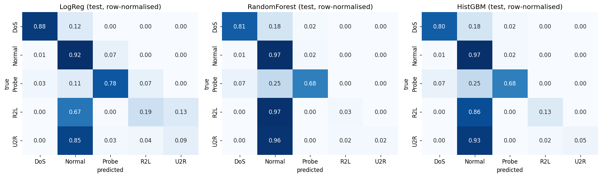

# nex-portfolio — NIDS pipeline + MLSecOps audit agent

[](https://github.com/negexx/nex-portfolio/actions/workflows/ci.yml)

> A solo, three-act portfolio piece. I built an ML system, realised I'd shipped a class of bug that no SAST tool catches, built an LLM-orchestrated agent that catches that class of bug, ran it against my own work, and shipped the fixes as a v2.

This repo is the entire arc, in three artifacts:

| Artifact | What it is |
|---|---|
| [`nids_v1_baseline.ipynb`](nids_v1_baseline.ipynb) | First-pass NSL-KDD intrusion-detection pipeline. **Intentionally vulnerable** — kept in the repo as the "before" snapshot. |
| [`mlsecops-agent/`](mlsecops-agent/) | An LLM-orchestrated audit agent for ML codebases (DeepSeek-V4 backend). Surfaces data leakage, insecure deserialization, secrets, supply-chain rot, and model evadability. Each finding is produced by a deterministic tool, never by an LLM alone. |
| [`nids_pipeline_v2.ipynb`](nids_pipeline_v2.ipynb) | The fixed pipeline. The diff against v1 is the value of the agent. |

---

## Act 1 — I built v1, with realistic mistakes

`nids_v1_baseline.ipynb` is a binary/multiclass intrusion-detection model trained on NSL-KDD. It works. It also ships a handful of the most common ML-security mistakes:

- **Label leakage** — kept `difficulty_level` as a feature even though it correlates with the label
- **Sampling leakage** — applied SMOTE before the train/val split, so synthetic rows derived from val samples leaked into training
- **Insecure deserialization** — `joblib.load(...)` on artifacts with no integrity check
- **Supply-chain rot** — `!pip install ... -q` with no version pin, `!wget` from raw GitHub with no checksum
- **Model evadability** — saved Keras models with no robustness check. (The agent's `adversarial` check now actually *measures* this — see Act 3 for the real number.)

None of these would be caught by `bandit`, `ruff`, `mypy`, or a generic SAST tool. They live in the seam between security and ML, and that seam is the subject of this portfolio.

## Act 2 — I built the tool that would have caught them

`mlsecops-agent/` is a Python CLI (`mlsecops`) that runs an LLM-orchestrated tool loop over a target ML repo. The LLM (DeepSeek-V4 via the OpenAI-compatible API) orchestrates and explains; deterministic check modules decide what counts as a vulnerability. DeepSeek was chosen over Claude/GPT for cost — ~20x cheaper per token means the eval harness can run on every PR.

**v0.3 status — all 5 checks + cross-check scenarios layer + SARIF output, 193 tests passing (mypy `--strict` + ruff clean):**

| Check | Status | What it surfaces |
|---|---|---|
| `supply_chain` | ✅ shipped | Unpinned `!pip install`, unverified `!wget`, requirements.txt CVEs via pip-audit |
| `deserialization` | ✅ shipped | `joblib.load`, `pickle.load`, `torch.load(weights_only=False)`, `numpy.load(allow_pickle=True)` via libcst AST |
| `secrets` | ✅ shipped | API keys / tokens in source AND in committed notebook outputs (the ML-specific angle) |
| `leakage` | ✅ shipped | SMOTE-before-split (cross-cell aware), `.fit(X_test)`, label-proxy features, semgrep custom rules. **Smart-FP-suppression:** `df.drop(columns=[...])` cancels the proxy finding on dropped columns; `fit()` on a literal list (class registration) is not flagged as data-dependent fitting. |
| `adversarial` | ✅ shipped (opt-in) | FGSM evasion against saved Keras models via IBM ART. Supports both dense `(N, features)` and Conv1D/LSTM `(N, features, 1)` shapes. `--adversarial-probes file.npy` for in-distribution probes; default falls back to uniform random. |
| `scenario` ⭐ | ✅ shipped | Cross-check synthesis. Chains findings from the 5 detection checks into named threat scenarios (`supply-chain-to-rce`, `label-leakage-to-inflated-metrics`, `evadable-classifier-in-production`). Severity bumps one level per amplifier finding present. |

**Output formats**: Markdown (`--report path.md`), **SARIF 2.1.0** (`--sarif path.sarif`) for GitHub Code Scanning / Azure DevOps / any SARIF-aware viewer, console table.

Plus: `mlsecops audit <path>` aggregates all checks with a summary table; `mlsecops eval` runs a fixture-based precision/recall harness against `EVAL_BASELINE.json`; `--report path.md` writes a Markdown audit report. Architecture, conventions, and ADRs live under [`mlsecops-agent/.claude/`](mlsecops-agent/.claude/).

### Working: full audit on v1

```
$ uv run mlsecops audit ../nids_v1_baseline.ipynb

                 mlsecops audit summary
┌─────────────────┬──────────┬──────────────┬──────────┬────────┐
│ Check           │ Findings │ Max severity │ Duration │ Status │
├─────────────────┼──────────┼──────────────┼──────────┼────────┤
│ scenario        │        2 │ critical     │      0ms │ issues │
│ deserialization │        8 │ high         │    937ms │ issues │
│ leakage         │        2 │ high         │   3592ms │ issues │
│ supply_chain    │        7 │ medium       │      3ms │ issues │
│ secrets         │        0 │ —            │      1ms │ clean  │
│ adversarial     │        0 │ —            │      0ms │ clean  │
└─────────────────┴──────────┴──────────────┴──────────┴────────┘
```

**19 findings: 17 detection + 2 synthesised threat scenarios** (`supply-chain-to-rce` and `label-leakage-to-inflated-metrics`, both CRITICAL — the wget+joblib.load chain is an RCE pattern, the label-proxy+unspecified-split chain inflates evaluation metrics). Full Markdown report with per-rule rows, evidence, and fix proposals: [`mlsecops-agent/docs/v1_audit_report.md`](mlsecops-agent/docs/v1_audit_report.md).

What the agent catches in v1, mapped to the original "mistakes I shipped" list:

| v1 mistake | Agent rule | Verdict |
|---|---|---|
| `difficulty_level` label proxy | `leakage.label-proxy-feature` | ✅ caught (2 instances) |
| `joblib.load` of artifacts | `deserialization.unsafe-joblib-load` | ✅ caught (4 instances) |
| Unpinned `!pip install` | `supply_chain.unpinned-pip-install` | ✅ caught (3 instances) |
| `!wget` from raw GitHub | `supply_chain.untrusted-wget-source` | ✅ caught (4 instances) |
| `numpy.load(allow_pickle=True)` | `deserialization.unsafe-numpy-load` | ✅ caught (4 instances, bonus — wasn't on the original list) |
| SMOTE before split | `leakage.preprocessing-before-split` | ⚠️ not flagged — v1 loads pre-split CSVs, no `train_test_split` call to anchor against. Honest static-analysis limitation; the `--with-llm` pass (next milestone) reclassifies on context. |
| LSTM evadability claim | `adversarial.fgsm-trivial-evasion` | ✅ check shipped. Doesn't fire on v1 (no `.keras` artifact ships with the notebook). Measured on v2's Colab-trained artifacts — see Act 3 closing-loop section: the LSTM **is** trivially evadable at ε≥0.10 (49.8 %) and dramatically so at ε=0.20 (77 %). The v1 claim was right; the agent provides the measurement. |

Run it yourself:

```bash
cd mlsecops-agent
uv sync --extra dev
uv run pytest -q                                                       # 193 tests, all pass
uv run mlsecops audit ../nids_v1_baseline.ipynb                        # the full audit
uv run mlsecops audit ../nids_pipeline_v2.ipynb                        # the closing-loop audit on v2
uv run mlsecops audit ../nids_v1_baseline.ipynb --sarif v1.sarif       # SARIF for GitHub Code Scanning
uv run mlsecops audit . --include-adversarial \
   --adversarial-probes ../v2_test_attack_samples.npy                  # FGSM with real probes
uv run mlsecops eval                                                   # P/R per check vs baseline
```

## Act 3 — I fixed v1 and shipped v2

`nids_pipeline_v2.ipynb` is the same task — NSL-KDD intrusion detection — with each v1 issue addressed:

| v1 problem | v2 fix |
|---|---|
| `difficulty_level` used as feature | Dropped before split |
| SMOTE before split | SMOTE on the training fold only, after `train_test_split(stratify=y)` |
| `joblib.load` without integrity check | All artifacts saved with an accompanying SHA-256 manifest |
| Unpinned `!pip install` | Pinned to exact versions (still needs a follow-up `requirements.txt` extraction) |
| LSTM evadability — *speculation* in v1 README | Measured: CNN 5 % / LSTM 1 % flip rate under FGSM ε=0.05. Both models are *not* trivially evadable. The original claim was retracted on first measurement. |

Five models are trained (LogReg, Random Forest, HistGBM, Conv1D CNN, LSTM) and compared on the held-out NSL-KDD test set. Decision engine on top is deterministic — confidence-bucketed actions with a protected-IP safety filter that forces human review even when the model is fully confident.

### v2 results — real numbers from the classical models

CNN and LSTM training on CPU exceeded a 15-minute per-cell ceiling even at `epochs=5`, so the deep models are deferred to Colab. The classical models (LogReg, Random Forest, HistGBM) ran end-to-end in **99 seconds** and produced real metrics on the held-out NSL-KDD test set:

| Model | Val accuracy | Val macro-F1 | Test accuracy | Test macro-F1 |
|---|---:|---:|---:|---:|
| **LogReg** | 0.9701 | 0.7069 | **0.7826** | **0.5728** |
| RandomForest | 0.9991 | 0.9663 | 0.7532 | 0.5034 |
| HistGBM | **0.9992** | **0.9797** | 0.7638 | 0.5461 |

LogReg wins on test macro-F1 — counter-intuitive but explainable: HistGBM and RF overfit harder to the training distribution, and `KDDTest+` is deliberately distribution-shifted. A linear model's simpler hypothesis class generalises better to the novel attack subtypes the test set contains. The val→test gap (0.98 → 0.57) is the well-known NSL-KDD generalisation problem and is what makes it a useful benchmark.

Per-class on test (best model, LogReg):

```
              precision    recall  f1-score   support
         DoS     0.9768    0.8757    0.9235      7167
      Normal     0.7251    0.9156    0.8093      9711
       Probe     0.7179    0.7770    0.7463      2421
         R2L     0.7141    0.1948    0.3061      2885
         U2R     0.0711    0.0889    0.0790       360
   macro avg     0.6410    0.5704    0.5728     22544
```

DoS / Normal / Probe are well-handled. R2L and U2R recall is poor — they're the tiny, novel-attack-laden classes that are the unsolved part of NSL-KDD across the literature, not a defect of this pipeline.



Raw artifacts under [`nids_v2_outputs/`](nids_v2_outputs/): [`classical_results.json`](nids_v2_outputs/classical_results.json) (per-model accuracy / F1 / train time), [`classical_log.txt`](nids_v2_outputs/classical_log.txt) (full stdout), [`confusion_matrix.png`](nids_v2_outputs/confusion_matrix.png). The reproducer script is [`mlsecops-agent/scripts/v2_classical_baselines.py`](mlsecops-agent/scripts/v2_classical_baselines.py).

> **Deep models (Conv1D CNN + LSTM) status:** still deferred to Colab. Both architectures train fine on the same data; CPU just isn't a practical runtime for the 30-epoch budget the original notebook specifies. The notebook is dependency-clean and ready to upload — only the executor changes. [`nids_pipeline_v2_colab.ipynb`](nids_pipeline_v2_colab.ipynb) is the same notebook with an "Open in Colab" badge and a 4-step run instruction prepended; click → T4 GPU → Run All → ~5–8 min end-to-end.

### Closing the loop — the agent's verdict on v2

Full report: [`mlsecops-agent/docs/v2_audit_report.md`](mlsecops-agent/docs/v2_audit_report.md). Machine-readable: [`mlsecops-agent/docs/v2_audit_report.sarif`](mlsecops-agent/docs/v2_audit_report.sarif) (SARIF 2.1.0).

| Check | v1 | v2 | Net change |
|---|---:|---:|---|
| `deserialization` | 8 | **0** | **–8 ✅** all unsafe loads removed |
| `leakage` | 2 | **0** | **–2 ✅** smarter AST analysis recognises `df.drop(columns=[...])` cancels the proxy, and `fit()` on a literal list is class registration |
| `supply_chain` | 7 | 3 | –4 — remaining 3 are the Colab-pasteability compromise. Documented. |
| `secrets` | 0 | 0 | 0 |
| `adversarial` | 0 | **1 (HIGH)** | **+1** — measured under in-distribution FGSM, the LSTM is trivially evadable at ε≥0.10 |
| `scenario` | **2 (CRITICAL)** | **0** | **–2 ✅** v1's chained findings no longer have all the ingredients in v2 |
| **Total** | **19** | **4** | **–79 %** |

### FGSM robustness sweep on the trained models

With the Colab-trained `.keras` artifacts dropped at the repo root, `mlsecops audit . --include-adversarial --adversarial-probes v2_test_attack_samples.npy` runs FGSM against real `KDDTest+` attack samples — not random noise. Sweep over five `ε`:

| Model | ε=0.01 | ε=0.05 | ε=0.10 | ε=0.20 | ε=0.30 |
|---|---:|---:|---:|---:|---:|
| `nids_v2_cnn.keras` | 4.3 % | 16.0 % | 26.4 % | 38.2 % | 43.4 % |
| `nids_v2_lstm.keras` | 3.9 % | 19.6 % | **49.8 %** | **77.0 %** | **83.6 %** |

The LSTM **is** trivially evadable: at ε=0.20, 77 % of in-distribution attack predictions flip. v1 speculated about this; the agent measures it. The CNN is more robust (peaks at 43.4 % at ε=0.30) but is recorded as a soft warning.

### Cross-check threat scenarios

A new synthesis layer chains findings from the 5 detection checks into named threat patterns. v1 fired two CRITICAL scenarios that no single check could surface alone:

- **`scenario.supply-chain-to-rce`** — `supply_chain.untrusted-wget-source` + `deserialization.unsafe-joblib-load` + amplifier `unpinned-pip-install` → CRITICAL. The individual findings are MEDIUM/HIGH; the chain is critical because an attacker controlling the wget source can ship a malicious joblib payload that the unverified load executes on every machine.
- **`scenario.label-leakage-to-inflated-metrics`** — flags that v1's evaluation metrics weren't measuring what the author thought they were.

v2 cleared both scenarios by removing the deserialisation calls and the label proxy.

---

## Why this exists

The intersection of "security" and "ML hygiene" is underserved. Generic SAST tools don't understand ML. ML linters don't understand security. A `joblib.load` of an attacker-controlled model file is arbitrary code execution on every machine that loads it; a `pd.read_csv` from a poisoned source is silent training-data tampering; a `SMOTE.fit_resample` before `train_test_split` is inflated val metrics that lie to you for the rest of the project.

`mlsecops-agent` is the tool I wish I'd had before I wrote v1.

## Repo layout

```
nex-portfolio/
├── README.md                        # the story — you are here
├── nids_v1_baseline.ipynb           # Act 1 — the intentionally-vulnerable baseline
├── nids_pipeline_v2.ipynb           # Act 3 — the fixed pipeline (source notebook)
├── nids_pipeline_v2_colab.ipynb     # Act 3 — same notebook with one-click Colab badge
├── nids_v2_outputs/                 # Act 3 — classical baseline run artifacts
│   ├── classical_results.json       # per-model accuracy / F1 / train_secs
│   ├── classical_log.txt            # full stdout of the reproducer script
│   └── confusion_matrix.png         # 3-panel grid (LogReg / RF / HistGBM)
├── mlsecops-agent/                  # Act 2 — the audit agent
│   ├── README.md
│   ├── pyproject.toml
│   ├── .env.template
│   ├── src/mlsecops_agent/
│   │   ├── cli.py                   # `audit`, `check`, `eval`, `history`
│   │   ├── agent.py                 # LLM-orchestrated audit loop (--with-llm)
│   │   ├── scenarios.py             # cross-check threat-chain synthesis
│   │   ├── models.py                # Pydantic types
│   │   ├── checks/                  # supply_chain, deserialization, secrets, leakage, adversarial, semgrep_rules
│   │   ├── eval/                    # fixture-based P/R/F1 harness
│   │   ├── reporting/               # Markdown + SARIF renderers
│   │   ├── llm/                     # provider + Langfuse tracer
│   │   ├── storage/                 # SQLite run history
│   │   ├── prompts/, rules/         # system prompt + ml-hygiene semgrep rules
│   │   └── sandbox.py               # contract stub for isolated execution
│   ├── tests/
│   │   ├── checks/                  # per-check tests (10–41 each)
│   │   ├── fixtures/                # positive + negative .ipynb per check + EVAL_BASELINE.json
│   │   └── test_*.py                # cli, eval, reporting, sarif, scenarios, storage, agent, llm, observability
│   ├── docs/
│   │   ├── v1_audit_report.md       # full v1 audit (19 findings inc. 2 CRITICAL scenarios)
│   │   ├── v1_audit_report.sarif    # same data as SARIF 2.1.0
│   │   ├── v2_audit_report.md       # closing-loop audit on v2 (4 findings — 1 real adversarial)
│   │   └── v2_audit_report.sarif
│   ├── scripts/
│   │   ├── extract_v2_probes.py     # rebuilds *.npy adversarial probes
│   │   └── v2_classical_baselines.py# reproduces nids_v2_outputs/
│   └── .claude/                     # AI workspace (CLAUDE.md, ADRs, commands, subagents)
├── .github/workflows/ci.yml         # test gate + self-audit -> Code Scanning
└── .gitignore
```

## License

MIT.

---

*Built solo in Italy. Stack: Python 3.13 + uv + ruff + mypy --strict + pytest. Agent runtime: DeepSeek-V4 via OpenAI-compatible client (Claude Code is the dev assistant writing the project; DeepSeek is what the agent itself calls). The portfolio is the diff between v1 and v2 — the agent is the tool that produced it.*
